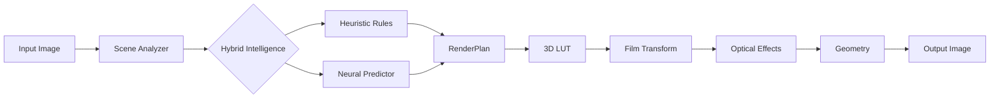

# Cinematic AI Photo Engine

Scene-aware cinematic photo transformation with a React frontend. Processes JPG, PNG, DNG/RAW batches through a 5-stage pipeline: adaptive 3D LUT, film curves, optical effects, and geometry rendering. Hybrid intelligence with neural predictor, concurrent processing, real-time progress, before/after compare, and ZIP export.

## Overview

CinematicAI analyzes each image's scene properties (brightness, contrast, warmth, shadows, highlights) and generates a tailored RenderPlan with 13 normalized parameters. A hybrid intelligence system blends heuristic rules with a trained neural network (MobileNet V3 Small) to produce cinematic results while preserving naturalness.

Batch processing supports concurrent download and processing, real-time SSE progress streaming, before/after comparison, and one-click ZIP export — all without persisting files to disk.

## Features

- **5-stage rendering pipeline** — adaptive 3D LUT, film response curves, optical effects, geometry rendering
- **Hybrid intelligence** — heuristic + trained neural predictor with confidence-weighted blending
- **RAW format support** — DNG, CR2, CR3, NEF, ARW, ORF, RW2, RAF, PEF, SRW
- **Batch processing** — multi-file upload or URL input with concurrency control (1-6x)
- **Real-time progress** — SSE streaming with per-file status updates
- **Before/after comparison** — drag divider viewer for processed vs original
- **Client-side ZIP export** — download all results without server storage
- **Three processing modes** — Automatic, Full Power, Custom (manual sliders)
- **Deterministic mode** — seed parameter for reproducible grain generation
- **Max image size control** — resize images via LANCZOS (512-8192px)

## Tech Stack

| Area | Technology |
|---|---|
| Backend | Python 3.10+, FastAPI, Uvicorn |
| Frontend | React 19, Vite 8, Tailwind CSS 4 |
| ML/Inference | PyTorch, MobileNet V3 Small |
| Image Processing | OpenCV, Pillow, NumPy, SciPy |
| RAW Support | rawpy |
| 3D LUT | [Image-Adaptive-3DLUT](https://github.com/HuiZeng/Image-Adaptive-3DLUT) (git submodule, Apache 2.0) |

## Quick Start

> Requires Python 3.10+, Node.js, and optionally a CUDA-capable GPU.

```bash
git clone --recurse-submodules https://github.com/gamertoky1188gro/Cinematic-AI-Photo-Engine.git
cd Cinematic-AI-Photo-Engine

python -m venv .venv
.venv\Scripts\activate          # Windows
# source .venv/bin/activate     # Linux/Mac

pip install torch torchvision --index-url https://download.pytorch.org/whl/cu126
pip install fastapi uvicorn pillow numpy scipy opencv-python rawpy pydantic

cd frontend && npm install && npm run build && cd ..

python server.py --port 8000
```

Open `http://localhost:8000` in your browser.

## Project Structure

```
CinematicAI/
├── server.py                 # FastAPI HTTP server with SSE streaming
├── test.py                   # CLI test/evaluation tool
├── train.py                  # Parameter predictor training script
├── engine/
│   ├── pipeline.py           # Main CinematicPipeline class
│   ├── analyzer.py           # SceneAnalyzer (brightness, contrast, warmth)
│   ├── intelligence.py       # Heuristic scene→plan controller
│   ├── hybrid_intelligence.py# Blends heuristic + learned predictions
│   ├── learned_intelligence.py
│   ├── render_plan.py        # RenderPlan dataclass (13 params)
│   ├── evaluate.py           # PSNR, SSIM, regression report
│   ├── quality_evaluator.py  # Naturalness/cinematicity scoring
│   └── stages/
│       ├── adaptive_lut.py   # 3D LUT color transform
│       ├── film_transform.py # S-curve, rolloff, tint, separation
│       ├── optical_renderer.py  # Halation, bloom, grain, vignette
│       └── geometry_renderer.py # Perspective, distortion, CA, softness
├── models/
│   ├── parameter_predictor.py # MobileNet V3 Small multi-head model
│   └── checkpoints/          # Trained .pth files (gitignored)
├── frontend/
│   ├── src/App.jsx           # React SPA
│   └── package.json
├── scripts/
│   ├── build_dataset.py
│   ├── build_references.py
│   ├── download_unsplash.py
│   └── retrain.py
├── Image-Adaptive-3DLUT/     # Git submodule (Apache 2.0)
│   └── pretrained_models/    # LUT + classifier weights
└── dataset/                  # Training images (gitignored)
```

## API Endpoints

| Method | Path | Description |
|---|---|---|
| `GET` | `/health` | Health check |
| `POST` | `/process` | Process image, return JPEG bytes |
| `POST` | `/process/json` | Process image, return JSON with base64 output |
| `POST` | `/process/stream` | Process image with SSE progress events |
| `POST` | `/process/stream/batch` | Batch process uploaded files (SSE) |
| `POST` | `/process/stream/batch/urls` | Batch process from URLs (SSE) |
| `GET` | `/download/zip` | Download all results as ZIP |
| `GET` | `/original/{batch_id}/{filename}` | Serve original image for comparison |

### Form Parameters

All processing parameters are optional (0.0-1.0 range). When omitted, scene-adaptive defaults are used.

| Parameter | Description |
|---|---|
| `film_strength` | Intensity of film response curve |
| `highlight_rolloff` | Highlight compression softness |
| `shadow_tint` | Color tint in shadow regions |
| `color_separation` | RGB channel separation |
| `halation` | Glow around bright areas |
| `bloom` | Soft light diffusion |
| `grain` | Film grain amount |
| `vignette` | Corner darkening |
| `lens_distortion` | Barrel/pincushion distortion |
| `chromatic_aberration` | RGB channel offset at edges |
| `edge_softness` | Soft focus at frame edges |
| `seed` | Random seed for deterministic grain |
| `max_size` | Max dimension in pixels (512-8192) |
| `concurrency` | Parallel workers for batch (1-6) |

## CLI Usage

```bash
# Process a single image
python test.py --input photo.jpg --output result.jpg

# Full evaluation report (PSNR, SSIM, per-stage metrics)
python test.py --input photo.jpg --report

# Save report as JSON
python test.py --input photo.jpg --report --report-json report.json

# A/B/C comparison (heuristic vs learned vs hybrid)
python test.py --input photo.jpg --compare

# LUT-only output (skip all effects)
python test.py --input photo.jpg --lut-only

# Override specific parameters
python test.py --input photo.jpg --film-strength 0.8 --grain 0.5

# Deterministic output
python test.py --input photo.jpg --output result.jpg --seed 42
```

### All CLI Flags

| Flag | Description |
|---|---|
| `--input` | Input image path (required) |
| `--output` | Output path (default: `output/<stem>_cinematic.<ext>`) |
| `--seed` | Random seed for deterministic grain |
| `--report` | Generate full evaluation report |
| `--report-json` | Save report to JSON file |
| `--compare` | Run A/B/C heuristic vs learned vs hybrid |
| `--predictor` | Path to predictor checkpoint |
| `--lut-only` | Skip all effects, LUT output only |
| `--film-strength` | Override film strength (0.0-1.0) |
| `--highlight-rolloff` | Override highlight rolloff |
| `--shadow-tint` | Override shadow tint |
| `--color-separation` | Override color separation |
| `--halation` | Override halation |
| `--bloom` | Override bloom |
| `--grain` | Override grain |
| `--vignette` | Override vignette |
| `--lens-distortion` | Override lens distortion |
| `--chromatic-aberration` | Override chromatic aberration |
| `--edge-softness` | Override edge softness |

## Training

```bash
# Train the parameter predictor
python train.py --dataset dataset/ --output models/checkpoints --epochs 50 --lr 1e-3

# With custom batch size and device
python train.py --dataset dataset/ --epochs 100 --batch-size 8 --device cuda
```

## Architecture



The pipeline analyzes scene properties, generates a 13-parameter RenderPlan via hybrid intelligence, then applies each rendering stage sequentially.

## License

- **Image-Adaptive-3DLUT** submodule: [Apache License 2.0](https://github.com/HuiZeng/Image-Adaptive-3DLUT/blob/master/LICENSE)
- Root project: `TODO: Add license`
